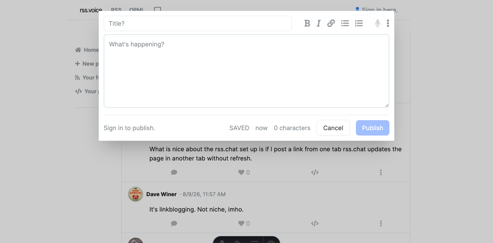
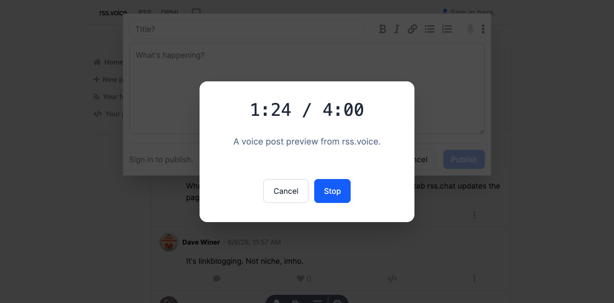
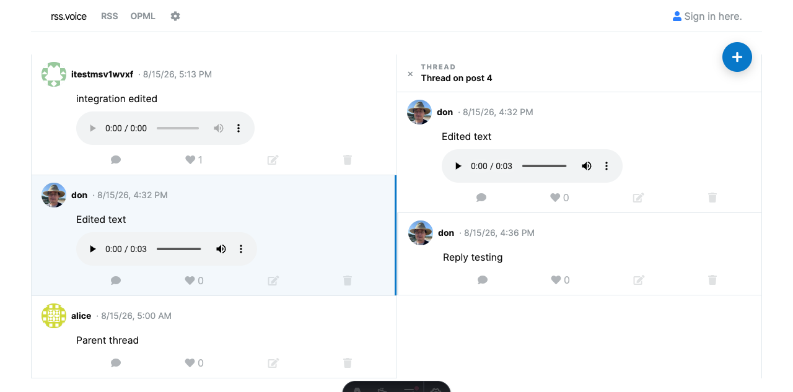

# rss.voice

An independent rss.chat-compatible voice-post network. The rewrite uses a protocol implementation of its own; the older reference materials in this repository are not runtime dependencies.

The implementation lives in `apps/server` and `apps/web`: a Cloudflare Worker/celld-compatible feed server, D1 schema, Astro frontend, and Tailwind theme system. It supports magic-link auth, ordinary text and voice posts, replies and recursive threads, edits, soft deletion, likes, media storage, range playback, a live firehose, rate limiting, and scheduled orphan-media cleanup.

rss.chat is a simple chat network, client and server, based on RSS 2.0 feeds and WebSockets. rss.voice adds audio enclosures to ordinary posts.

### Local development

Install dependencies and apply the local D1 migration from the repository root:

```sh
npm install
npx wrangler d1 migrations apply rss-voice --local --config apps/server/wrangler.toml
```

Start the Worker in one terminal:

```sh
npx wrangler dev --local --port 8787 --config apps/server/wrangler.toml
```

Start the Astro frontend in a second terminal:

```sh
PUBLIC_API_URL=http://127.0.0.1:8787 npm run dev --workspace=@rss-voice/web -- --host 127.0.0.1 --port 4321
```

Open the frontend at <http://127.0.0.1:4321/>. The local API is available at <http://127.0.0.1:8787/health>, and the RSS feed is at <http://127.0.0.1:8787/users/rss.xml>.

For the integration smoke test, run the Worker separately and execute:

```sh
TEST_SERVER_URL=http://127.0.0.1:8787 npm --workspace @rss-voice/server run test:integration
```

### Remote setup

The Worker can be deployed to Cloudflare. First create its D1 database and R2 media bucket:

```sh
npx wrangler d1 create rss-voice
npx wrangler r2 bucket create rss-voice-media
```

Update `apps/server/wrangler.toml` with the returned D1 `database_id`, your public API `BASE_URL`, and the frontend `WEB_URL`. Then apply the schema remotely and deploy:

```sh
npx wrangler d1 migrations apply rss-voice --remote --config apps/server/wrangler.toml
npx wrangler deploy --config apps/server/wrangler.toml
```

Build the Astro frontend with the deployed API URL, then publish `apps/web/dist` using your static hosting provider:

```sh
PUBLIC_API_URL=https://api.example.com npm run build --workspace=@rss-voice/web
```

Set `MAIL_WEBHOOK_URL` in the remote Worker for production magic-link email delivery. See [`apps/server/README.md`](apps/server/README.md) for Cloudflare R2, celld S3, mail, rate-limit, and deployment configuration.

### Voice recording



### Voice recording in progress (4 minutes max)



### Voice posts


